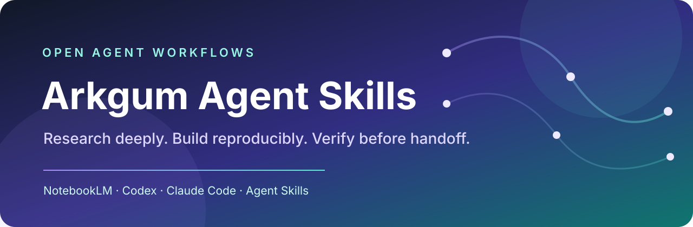

<p align="center">
  
</p>

<p align="center">
  <a href="https://github.com/arkgum/arkgum-agent-skills/actions/workflows/validate.yml"></a>
  <a href="LICENSE"></a>
  <a href="https://agentskills.io"></a>
  <a href="https://github.com/arkgum/arkgum-agent-skills/stargazers"></a>
</p>

<h1 align="center">Arkgum Agent Skills</h1>

<p align="center">
  A source-grounded research workflow for Codex, Claude Code, Cursor, and other AI agents.
</p>

This collection turns vague requests into durable, reviewable artifacts. It emphasizes evidence, explicit approval gates, reproducible prompts, deterministic helper scripts, and QA before handoff.

## Quick start

Browse the available skills:

```bash
npx skills add arkgum/arkgum-agent-skills --list
```

Install one skill:

```bash
npx skills add arkgum/arkgum-agent-skills@arkgum-research-to-page
```

See [all installation options](docs/installation.md), including global, agent-specific, and manual installation.

## Skills

| Skill | What it does | Best for | Requirements |
|---|---|---|---|
| [`arkgum-research-to-page`](skills/arkgum-research-to-page/) | Runs source-grounded NotebookLM research, ranks page opportunities, and produces a cited brief plus builder-ready prompt. | Landing pages, research pages, product narratives, content-gap exploration. | NotebookLM MCP or compatible NotebookLM CLI. |

## Example prompts

```text
Use $arkgum-research-to-page to research how an Obsidian vault can become
a personal LLM Wiki, then produce a builder-ready landing-page specification.
```

More examples are available in [examples/prompts.md](examples/prompts.md).

## Why this collection

- **Grounded before generated.** Claims are traced to sources, and uncertainty stays visible.
- **Artifacts over chat residue.** Research reports, manifests, prompts, briefs, and QA files survive the session.
- **Human gates where judgment matters.** Visual plans and irreversible actions require approval.
- **Deterministic where repetition matters.** Scripts handle scaffolding, validation, normalization, and packaging.
- **Portable skill structure.** Every skill follows the open [Agent Skills specification](https://agentskills.io/specification).

## Repository structure

```text
arkgum-agent-skills/
├── skills/                 # Installable, self-contained Agent Skills
├── scripts/                # Repository-level static validation
├── examples/               # Copy-ready prompts
├── docs/                   # Installation, quality bar, and launch notes
├── .github/                # CI and community templates
├── catalog.json            # Machine-readable skill catalog
└── README.md
```

Each installable skill contains a required `SKILL.md` and only the resources needed at runtime:

```text
skill-name/
├── SKILL.md
├── agents/                 # Optional UI metadata
├── scripts/ or tools/      # Deterministic helpers
├── references/             # Documentation loaded on demand
└── assets/                 # Templates and reusable output resources
```

## Quality standard

Every published skill must be specific, inspectable, and safe to install. CI checks naming, frontmatter, broken local links, accidental personal paths, and common secret patterns. See [docs/quality-standard.md](docs/quality-standard.md).

Skills can execute tools and scripts. Review a skill before installing it, understand its external dependencies, and grant only the permissions needed for the current task.

## Contributing

Bug reports, documentation improvements, compatibility fixes, and focused skills are welcome. Read [CONTRIBUTING.md](CONTRIBUTING.md) before opening a pull request.

## License

Released under the [MIT License](LICENSE). Third-party services and companion skills keep their own terms and licenses.

---

If this workflow saves you research or production time, consider [starring the repository](https://github.com/arkgum/arkgum-agent-skills). It helps other people discover the project.
